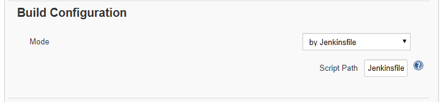

# spring-boot-journal
spring-boot-journal 앱과 kubernetes 배포 구성

※사전작업
Helm을 이용한 Kubernetes에 Jenkins 설치하기

참고 : 
https://github.com/GoogleCloudPlatform/continuous-deployment-on-kubernetes


Jenkins -> 새로운 Item

  
  
  
  
  
  
   
  

Jenkins에서 git 의 소스를 스캔하여 master라는 브랜치에 대한 빌드 아이템 생성
   
  

빌드 과정은 Jenkins file에 적혀있는 Stage와 Step을 순서대로 진행하게 된다.
여기에서는 빌드를 진행하는 agent에 대한 정보도 선언에 따라 프로비저닝하여 진행하게 된다.

```groovy
pipeline {

  environment {
    PROJECT = "eunbyul"
    APP_NAME = "spring-boot-journal"
    CLUSTER = "jenkins-cd"
    CLUSTER_ZONE = "us-east1-d"
    IMAGE_TAG = "gcr.io/${PROJECT}/${APP_NAME}:${env.BRANCH_NAME}.${env.BUILD_NUMBER}"
    JENKINS_CRED = "${PROJECT}"
  }

  agent {
    kubernetes {
      label 'spring-boot-journal'
      defaultContainer 'jnlp'
      yaml """
apiVersion: v1
kind: Pod
metadata:
labels:
  component: ci
spec:
  # Use service account that can deploy to all namespaces
  serviceAccountName: cd-jenkins
  containers:
  - name: gcloud
    image: gcr.io/cloud-builders/gcloud
    command:
    - cat
    tty: true
  - name: kubectl
    image: gcr.io/cloud-builders/kubectl
    command:
    - cat
    tty: true
  - name: mvn
    image: gcr.io/cloud-builders/mvn
    command:
    - cat
    tty: true
"""
}
  }
  stages {
      stage('Build'){
          steps{
             container('mvn'){
                 sh "mvn package -DskipTests"
             }
          }
      }
     stage('Build and push image with Container Builder') {
       steps {
         container('gcloud') {
           sh """
            ln -s `pwd` /spring-boot-journal
            cd /spring-boot-journal
           """
           sh "PYTHONUNBUFFERED=1 gcloud builds submit -t ${IMAGE_TAG} ."
         }
       }
     }
    stage('Deploy') {
      // master
      when { branch 'master' }
      steps{
        container('kubectl') {
        // Change deployed image in canary to the one we just built
          sh("sed -i.bak 's#gcr.io/eunbyul/spring-boot-journal:v1#${IMAGE_TAG}#' spring-boot-journal.yaml")
          step([$class: 'KubernetesEngineBuilder',namespace:'journal', projectId: env.PROJECT, clusterName: env.CLUSTER, zone: env.CLUSTER_ZONE, manifestPattern: 'spring-boot-journal.yaml', credentialsId: env.JENKINS_CRED, verifyDeployments: false])
       }
      }
    }
  }
}
```


배포 결과 확인
```shell
$ kubectl get deploy -n journal
NAME                  DESIRED   CURRENT   UP-TO-DATE   AVAILABLE   AGE
spring-boot-journal   1         1         1            1           8h
```

빌드 진행의 Stage별로 소요 시간 및 결과 정보 등을 확인 할 수 있다.
   


웹에서 확인하기
```shell
$ export POD_NAME=$(kubectl get pods -n journal -o jsonpath="{.items[0].metadata.name}")
$ kubectl port-forward -n journal $POD_NAME 12000:12000 >> /dev/null &
[1] 3928
```

Cloud shell에서 포트를 변경하여 미리보기를 실행한 후 /swagger-ui.html 페이지로 접속하면 아래 페이지를 확인 할 수 있다.

   
  

POD 확인
```shell
    State:          Running
      Started:      Fri, 23 Aug 2019 22:24:35 +0900
    Ready:          True
    Restart Count:  0
    Readiness:      http-get http://:12000/health delay=0s timeout=1s period=10s #success=1 #failure=3
    Environment:    <none>
    Mounts:
      /var/run/secrets/kubernetes.io/serviceaccount from default-token-hwfpk (ro)
Conditions:
  Type              Status
  Initialized       True
  Ready             True
  ContainersReady   True
  PodScheduled      True
Volumes:
  default-token-hwfpk:
    Type:        Secret (a volume populated by a Secret)
    SecretName:  default-token-hwfpk
    Optional:    false
QoS Class:       BestEffort
Node-Selectors:  <none>
Tolerations:     node.kubernetes.io/not-ready:NoExecute for 300s
                 node.kubernetes.io/unreachable:NoExecute for 300s
Events:
  Type     Reason     Age                    From                                                Message
  ----     ------     ----                   ----                                                -------
  Normal   Scheduled  2m43s                  default-scheduler                                   Successfully assigned journal/spring-boot-journal-854cbd9fcf-vkdv9 to gke-jenkins-cd-default-pool-eb065e61-7xs1
  Normal   Pulling    2m41s                  kubelet, gke-jenkins-cd-default-pool-eb065e61-7xs1  pulling image "gcr.io/eunbyul/spring-boot-journal:master.2"
  Normal   Pulled     2m38s                  kubelet, gke-jenkins-cd-default-pool-eb065e61-7xs1  Successfully pulled image "gcr.io/eunbyul/spring-boot-journal:master.2"
  Normal   Created    2m38s                  kubelet, gke-jenkins-cd-default-pool-eb065e61-7xs1  Created container
  Normal   Started    2m38s                  kubelet, gke-jenkins-cd-default-pool-eb065e61-7xs1  Started container
  Warning  Unhealthy  2m20s (x2 over 2m30s)  kubelet, gke-jenkins-cd-default-pool-eb065e61-7xs1  Readiness probe failed: Get http://10.32.1.131:12000/health: dial tcp 10.32.1.131:12000: connect: connection refused
  ```
